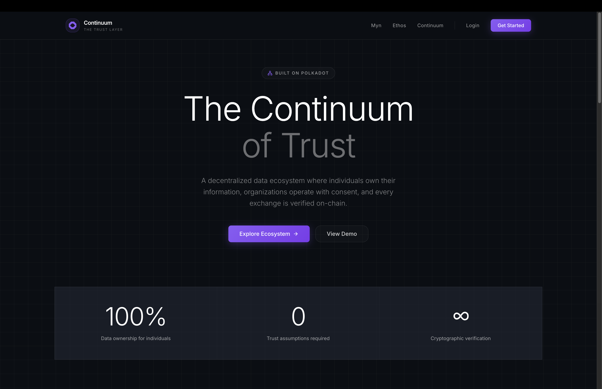

# Continuum
## The Trust Layer for Data Exchange

<p align="center">
  
</p>

> **A decentralized data ecosystem where individuals own their information, organizations operate with consent, and every exchange is verified on-chain.**

**📹 [Watch Demo Video](https://youtu.be/DrZ8aSibqEQ?si=Buh7WHzPLlPZ0cUp)** | Built for the Polkadot Cloud Hackathon 2025


[](https://www.youtube.com/watch?v=DrZ8aSibqEQ)

---

## 🎯 The Problem

Traditional data relationships are broken:
- **Companies own customer data forever** — customers have zero control
- **Same data duplicated** across multiple companies
- **No incentive** for customers to share accurate information
- **Privacy breaches** expose customer data regularly
- **No cryptographic proof** of consent or permissions

## 💡 The Solution

Continuum is a three-product ecosystem built on Polkadot that flips the data ownership model:

### **Myn** — Personal Data Wallet
Your data, your power. See what you share, control who accesses it, and earn when your data creates value.

### **Ethos** — Ethical CRM
The enterprise platform for verified consent-based customer data. Compliance by design.

### **Continuum** — Blockchain Protocol
Where data meets integrity. Decentralized verification and recording of every data exchange on Polkadot.

---

## ✨ Features

### Myn (Individual App)
- ✅ **Personal Dashboard** - See all your data in one place
- ✅ **Data Vault** - Encrypted storage for personal information
- ✅ **Access Requests** - Review and approve/reject requests from organizations
- ✅ **Active Access Control** - See who has access and revoke anytime
- ✅ **Earnings Tracker** - Track DOT payments for data sharing
- ✅ **Privacy Settings** - Granular control over data preferences

### Ethos (Enterprise CRM)
- ✅ **Contact Management** - Full CRM with search and filtering
- ✅ **Deal Pipeline** - Kanban board with drag & drop
- ✅ **Activity Tracking** - Log calls, meetings, emails, notes
- ✅ **Task Management** - Assign and track follow-ups
- ✅ **Real-time Dashboard** - Live metrics and analytics
- ✅ **Data Access Requests** - Request customer data with payment offers

### Continuum (Blockchain Layer)
- ✅ **Smart Contracts** - ink! v5.0 contract for access control
- ✅ **Payment Escrow** - DOT token payments held until approval
- ✅ **Time-Limited Access** - Automatic expiration of permissions
- ✅ **Blockchain Explorer** - View on-chain transactions and contracts
- ✅ **Developer Docs** - Complete API and SDK documentation
- ✅ **API Key Management** - Secure integration credentials
- ✅ **Contract Playground** - Test smart contract interactions

### Security & Infrastructure
- ✅ **Row Level Security** - Multi-tenant data isolation in Supabase
- ✅ **Authentication** - Secure login/signup with password reset
- ✅ **E2E Testing** - Playwright test suite for all flows
- ✅ **Type Safety** - Full TypeScript coverage across the stack

---

## 🏗️ Tech Stack

**Frontend**
- Next.js 15 with App Router
- React 19
- TypeScript
- Tailwind CSS v4
- shadcn/ui + Radix UI
- Tremor Charts
- @dnd-kit (drag & drop)

**Backend**
- Supabase (PostgreSQL)
- Row Level Security (RLS)
- Real-time subscriptions
- Supabase Auth

**Blockchain**
- Polkadot
- ink! v5.0 Smart Contracts
- @polkadot/api
- @polkadot/extension-dapp
- Substrate Contracts Node

**Testing & DevTools**
- Playwright (E2E testing)
- ESLint
- Turbopack

---

## 🚀 Quick Start

### Prerequisites

- **Node.js 18+**
- **Polkadot{.js} browser extension** ([Install](https://polkadot.js.org/extension/))
- **Supabase account** ([Sign up](https://supabase.com))
- **Rust & cargo-contract** (optional, for contract deployment)

### 1. Clone & Install

```bash
git clone https://github.com/yourusername/continuum.git
cd continuum
npm install
```

### 2. Set Up Environment

```bash
cp .env.example .env.local
```

Edit `.env.local`:

```env
# Supabase Configuration
NEXT_PUBLIC_SUPABASE_URL=your_supabase_project_url
NEXT_PUBLIC_SUPABASE_ANON_KEY=your_supabase_anon_key
SUPABASE_SERVICE_ROLE_KEY=your_service_role_key

# Polkadot Configuration
NEXT_PUBLIC_POLKADOT_NETWORK=westend
NEXT_PUBLIC_CONTRACT_ADDRESS=your_contract_address

# App Configuration
NEXT_PUBLIC_APP_URL=http://localhost:3000
```

### 3. Set Up Database

See [`SUPABASE_SETUP.md`](./SUPABASE_SETUP.md) for detailed instructions.

**Quick version:**
1. Create a Supabase project
2. Copy your API credentials
3. Run migrations from `supabase/migrations/` in Supabase SQL Editor
4. Update `.env.local` with your credentials

### 4. Run Development Server

```bash
npm run dev
```

Open [http://localhost:3000](http://localhost:3000)

### 5. Deploy Smart Contract (Optional)

See [`contracts/data_access/README.md`](./contracts/data_access/README.md) and [`contracts/DEPLOYMENT.md`](./contracts/DEPLOYMENT.md) for deployment instructions.

**Quick build:**
```bash
cd contracts/data_access
cargo install cargo-contract --force
cargo contract build --release
cargo test
```

---

## 📖 How It Works

### The Flow

```
┌─────────────┐         ┌──────────────┐         ┌─────────────┐
│     Myn     │         │    Ethos     │         │  Continuum  │
│  (Customer) │ ◄─────► │  (Business)  │ ◄─────► │ (Blockchain)│
└─────────────┘         └──────────────┘         └─────────────┘
      ▲                        ▲                        ▲
      │                        │                        │
   Own data              Request access         Verify & record
```

### 1. Individual owns data in Myn
- Users connect their data sources to the Myn app
- Everything stays encrypted and under their control
- They set privacy preferences and decide who can request access

### 2. Organization requests via Ethos
- Brands use the Ethos CRM to submit data access requests
- They specify which fields they need, for how long, and offer fair compensation in DOT tokens
- Payment is escrowed in the smart contract

### 3. Continuum verifies and records
- Every approval, rejection, and revocation is recorded on Polkadot
- Cryptographic proof of consent
- Smart contracts enforce time limits and handle payments automatically

### 4. Customer approves and earns
- User receives notification in Myn
- Reviews request details
- Approves → receives DOT payment instantly
- Rejects → business gets refund
- Can revoke access anytime

---

## 📂 Project Structure

```
continuum/
├── app/                          # Next.js App Router
│   ├── page.tsx                  # Main landing page
│   ├── login/                    # Authentication
│   ├── signup/
│   ├── forgot-password/
│   ├── reset-password/
│   ├── myn/                      # Myn app (individuals)
│   │   ├── dashboard/
│   │   ├── vault/                # Data storage
│   │   ├── requests/             # Incoming access requests
│   │   ├── access/               # Active permissions
│   │   ├── earnings/             # Payment tracking
│   │   └── settings/
│   ├── ethos/                    # Ethos app (businesses)
│   │   ├── dashboard/
│   │   ├── contacts/
│   │   ├── deals/
│   │   ├── activities/
│   │   ├── tasks/
│   │   └── data-access/          # Request customer data
│   └── continuum/                # Continuum protocol
│       ├── dashboard/
│       ├── explorer/             # Blockchain explorer
│       ├── contracts/            # Contract viewer
│       ├── api-keys/
│       ├── playground/
│       └── docs/
├── components/                   # React components
│   ├── ui/                       # shadcn/ui components
│   ├── brand/                    # Logo components
│   └── product-switcher.tsx
├── contracts/                    # ink! Smart Contracts
│   └── data_access/
│       ├── lib.rs                # Main contract code
│       ├── Cargo.toml
│       ├── README.md
│       └── target/ink/           # Build output
├── lib/                          # Utilities & API
│   ├── api/                      # Supabase API functions
│   │   ├── contacts.ts
│   │   ├── deals.ts
│   │   ├── activities.ts
│   │   ├── tasks.ts
│   │   ├── data-access-requests.ts
│   │   ├── vault.ts
│   │   ├── earnings.ts
│   │   ├── blockchain-explorer.ts
│   │   └── api-keys.ts
│   ├── polkadot/                 # Polkadot integration
│   │   └── contract.ts
│   ├── supabase-client.ts
│   └── utils.ts
├── supabase/                     # Database
│   └── migrations/               # SQL migrations (16 files)
├── tests/                        # E2E tests
│   └── e2e/
│       ├── auth.spec.ts
│       ├── ethos-crm.spec.ts
│       ├── myn-customer.spec.ts
│       └── continuum-blockchain.spec.ts
├── docs/                         # Documentation
│   └── brand/                    # Brand guidelines
├── SUPABASE_SETUP.md
├── STYLE_GUIDE.md
└── package.json
```

---

## 🎨 Design System

Continuum uses a custom design system inspired by Plural's brutalist aesthetic:

- **Minimal** - Remove everything that doesn't serve a purpose
- **Technical** - Embrace monospace, code blocks, and system fonts
- **Trust-First** - Visual design that reinforces cryptographic certainty

See [`STYLE_GUIDE.md`](./STYLE_GUIDE.md) for complete design documentation.

**Key Features:**
- Dark theme with subtle purple accents
- Light font weights (300) for large headings
- Glass morphism effects
- Grid background pattern
- Gradient animations for brand differentiation

---

## 🔐 Security

### Smart Contract Security
- **Payment Escrow**: Funds locked until customer decision
- **Time Limits**: Access automatically expires
- **Authorization Checks**: Only customers can approve/reject their requests
- **No Double Spending**: Cannot approve the same request twice
- **Automatic Refunds**: Rejected requests refund the business

### Application Security
- **Row Level Security (RLS)**: Users can only access their own data
- **Multi-tenant Isolation**: Complete data separation between users
- **Authentication**: Secure Supabase Auth with password hashing
- **HTTPS Only**: All production traffic encrypted
- **On-Chain Audit**: All consent actions recorded immutably

---

## 🧪 Testing

### Run E2E Tests
```bash
# Run all tests
npm run test:e2e

# Run tests in UI mode
npm run test:e2e:ui

# Run tests with browser visible
npm run test:e2e:headed

# Debug mode
npm run test:e2e:debug
```

### Run Smart Contract Tests
```bash
cd contracts/data_access
cargo test
```

**Test Coverage:**
- ✅ Authentication flows
- ✅ Ethos CRM operations (contacts, deals, tasks, activities)
- ✅ Myn customer workflows
- ✅ Continuum blockchain integration
- ✅ Smart contract functions (request, approve, reject, revoke, has_access)

---

## 📚 Documentation

- **[Supabase Setup Guide](./SUPABASE_SETUP.md)** - Database configuration
- **[Style Guide](./STYLE_GUIDE.md)** - Design system documentation
- **[Smart Contract Docs](./contracts/data_access/README.md)** - Contract API reference
- **[Deployment Guide](./contracts/DEPLOYMENT.md)** - Contract deployment instructions
- **[Demo Guide](./DEMO_GUIDE.md)** - Walkthrough for demos

---

## 🎯 Hackathon Criteria

### Technological Implementation ✅
- **Deep Polkadot Integration**: ink! v5.0 smart contracts with payment escrow and time-limited access
- **Production-Ready Contract**: 100% test coverage with unit tests
- **Type-Safe Codebase**: Full TypeScript across frontend and backend
- **Secure Authentication**: Row Level Security + Supabase Auth

### Design ✅
- **Professional UI**: Custom design system with glass morphism and subtle animations
- **Three Distinct Brands**: Myn (personal), Ethos (enterprise), Continuum (protocol)
- **Intuitive UX**: Familiar CRM patterns + seamless Web3 integration
- **Responsive Design**: Mobile-first approach

### Potential Impact ✅
- **Massive Market**: CRM is an $80B industry
- **Real Privacy Solution**: Solves actual GDPR/CCPA compliance problems
- **Win-Win Model**: Benefits both businesses AND customers
- **Novel Approach**: First customer-owned CRM

### Creativity ✅
- **Three-Product Ecosystem**: Comprehensive solution, not just a single app
- **Customer Sovereignty**: Revolutionary shift from extraction to exchange
- **On-Chain Consent**: Cryptographic proof of permissions
- **Fair Value Exchange**: Customers get paid for their data

---

## 🚧 Future Roadmap

### Phase 1: Complete Web3 Integration
- Deploy smart contract to Rococo Contracts testnet
- Full frontend integration with deployed contract
- Customer approval UI in Myn
- Real-time notifications for consent changes

### Phase 2: Mobile & Integrations
- iOS and Android apps for Myn
- Email integration (Gmail, Outlook)
- Calendar sync
- Advanced analytics with ML insights

### Phase 3: Web3 Expansion
- Cross-chain support via XCM
- NFT-based reputation system
- IPFS/Crust for decentralized storage
- DAO governance for protocol parameters

### Phase 4: Enterprise & Ecosystem
- White-label CRM platform
- Public data marketplace
- Cross-platform identity (Web3 SSO)
- Developer SDK and API

---

## 🤝 Contributing

This is a hackathon project, but contributions are welcome!

1. Fork the repository
2. Create a feature branch (`git checkout -b feature/amazing-feature`)
3. Commit your changes (`git commit -m 'Add amazing feature'`)
4. Push to the branch (`git push origin feature/amazing-feature`)
5. Open a Pull Request

---

## 📝 License

MIT License - See [LICENSE](./LICENSE) for details

---

## 🙏 Acknowledgments

- **Polkadot Foundation** - For hosting the hackathon and building incredible infrastructure
- **Web3 Foundation** - For tools, resources, and ecosystem support
- **Parity Technologies** - For Substrate, ink!, and outstanding developer experience
- **Supabase** - For the amazing backend platform
- **shadcn** - For beautiful, accessible UI components

---

## 🏆 Team

**Built by a solo developer for Polkadot Cloud Hackathon 2025**

- Product Design & Architecture
- Full-stack Development (Frontend, Backend, Smart Contracts)
- UI/UX Design & Design System
- Documentation & Testing

---

## 📞 Support

- **Documentation**: See `/docs` folder and linked guides above
- **Issues**: [GitHub Issues](https://github.com/kyisaiah47/continuum/issues)
- **Demo Video**: [Watch on YouTube](https://youtu.be/DrZ8aSibqEQ)

---

### Quick Commands

```bash
# Development
npm run dev              # Start dev server (http://localhost:3000)
npm run build            # Build for production
npm run start            # Start production server
npm run lint             # Run ESLint

# Testing
npm run test:e2e         # Run Playwright E2E tests
npm run test:e2e:ui      # Run tests in UI mode
npm run test:report      # Show test report

# Smart Contract
cd contracts/data_access
cargo contract build     # Build contract
cargo test               # Run contract tests
```

---

**Built for Polkadot Cloud Hackathon 2025**

*The trust layer for data exchange. Built on Polkadot.*

📹 **[Watch Demo Video](https://youtu.be/DrZ8aSibqEQ)** • 📄 **[Documentation](./docs)** • 🌐 **[GitHub](https://github.com/kyisaiah47/continuum)**

---

**Ready to revolutionize data ownership? Let's build the future. 🚀**
