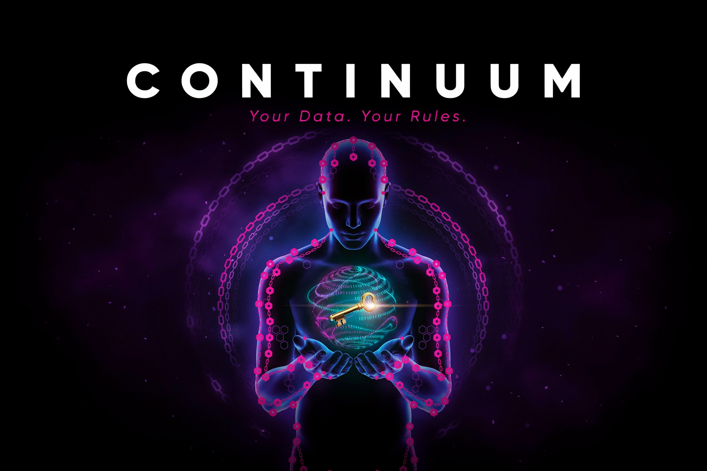

<div align="center">



# 🔗 Continuum

**The CRM where customers own their data — businesses rent access, not ownership**

  

*Polkadot Cloud Hackathon 2025*

</div>

<br/>

Traditional CRMs give businesses permanent ownership of customer data — Continuum flips that model. Customers store their information in a personal data wallet, businesses submit time-limited access requests with DOT token payment, and every consent decision is cryptographically recorded on Polkadot via ink! smart contracts. When a customer approves, the DOT is released to them; when they revoke, access expires automatically on-chain.

## ✨ Features

- **Customer Data Sovereignty** — individuals own and control their data through the Myn personal wallet; businesses can only request temporary, consent-gated access
- **DOT-Powered Consent** — businesses escrow DOT tokens in a smart contract when requesting access; customers receive payment on approval, businesses get a refund on rejection
- **Time-Limited Permissions** — ink! v5.0 smart contracts enforce automatic access expiration; no perpetual data ownership by third parties
- **Ethical CRM (Ethos)** — full enterprise CRM with contacts, deal pipeline, activity tracking, and a dedicated flow to request customer data with fair compensation
- **On-Chain Audit Trail** — every approval, rejection, and revocation is immutably recorded on Polkadot, providing cryptographic proof of consent
- **Multi-Tenant Security** — Supabase Row Level Security isolates data per user; full TypeScript coverage and Playwright E2E test suite across all flows

## 🎥 Demo

[](https://youtu.be/DrZ8aSibqEQ)

## 🛠️ Tech Stack

Next.js 15 · React 19 · TypeScript · Supabase (PostgreSQL + RLS + Auth) · Polkadot · ink! v5.0 Smart Contracts · DOT · Tailwind CSS v4 · shadcn/ui · Playwright

## 🚀 Getting Started

```bash
# 1. Clone & install
git clone https://github.com/kyisaiah47/continuum.git
cd continuum
npm install

# 2. Configure environment
cp .env.example .env.local
# Set NEXT_PUBLIC_SUPABASE_URL, NEXT_PUBLIC_SUPABASE_ANON_KEY,
# SUPABASE_SERVICE_ROLE_KEY, NEXT_PUBLIC_POLKADOT_NETWORK, NEXT_PUBLIC_CONTRACT_ADDRESS

# 3. Run migrations (see SUPABASE_SETUP.md for details)

# 4. Start dev server
npm run dev
# Open http://localhost:3000
```

**Smart contract (optional):**
```bash
cd contracts/data_access
cargo install cargo-contract --force
cargo contract build --release
cargo test
```

See [`SUPABASE_SETUP.md`](./SUPABASE_SETUP.md) and [`contracts/DEPLOYMENT.md`](./contracts/DEPLOYMENT.md) for full setup guides.

## 📄 License

MIT
